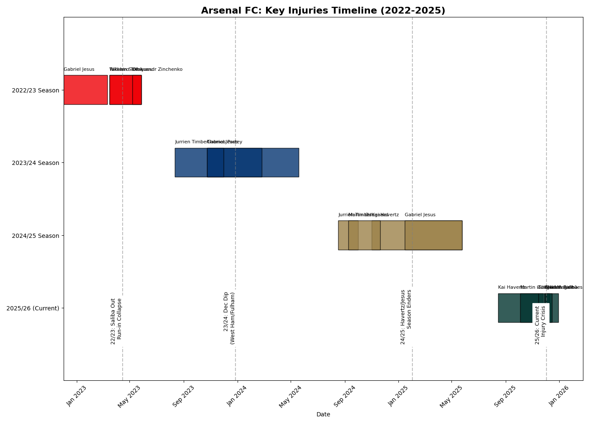

# ⚽ Arsenal FC: Injury Impact Analysis (2022-2026)

A data-driven analysis of how key player injuries have correlated with Arsenal's Premier League title challenges over the last four seasons.



## 📊 Project Overview
This project investigates the hypothesis that **structural injuries** (to key players in defense, midfield, and attack) have been the primary cause of Arsenal's late-season collapses, rather than "mental fragility."

Using Python, I analyzed injury data from 2022 to the present (2025/26 season) and visualized the correlation between player absences and dropped points.

### Key Findings
*   **2022/23:** The loss of **William Saliba** (Back) in March directly aligned with the defensive collapse that cost the title.
*   **2023/24:** **Jurrien Timber's** season-long ACL injury severely limited tactical depth and rotation options.
*   **2024/25:** Losing both **Gabriel Jesus** and **Kai Havertz** to long-term injuries decimated the attack in the run-in.
*   **2025/26 (Current):** The team is currently top, but facing a critical test with injuries to the defensive spine (**Saliba, Gabriel, Rice**).

## 🛠️ Tech Stack
*   **Python 3.10+**
*   **Streamlit:** For the interactive web dashboard.
*   **Plotly Express:** For interactive Gantt charts and visualizations.
*   **Matplotlib:** For static timeline generation.
*   **Pandas:** For data manipulation.

## 🚀 How to Run Locally

1.  **Clone the repository:**
    ```bash
    git clone https://github.com/sucheet2000/arsenal-injury-analysis.git
    cd arsenal-injury-analysis
    ```

2.  **Install dependencies:**
    ```bash
    pip install -r requirements.txt
    ```

3.  **Run the dashboard:**
    ```bash
    streamlit run dashboard.py
    ```

## 📂 Project Structure
*   `dashboard.py`: The main Streamlit application.
*   `analyze_injuries.py`: Python script used to generate the static timeline visualizations.
*   `requirements.txt`: List of Python dependencies.
*   `arsenal_injury_timeline_v2.png`: Generated visualization of the injury timeline.

---
*Analysis by Sucheet Boppana*
